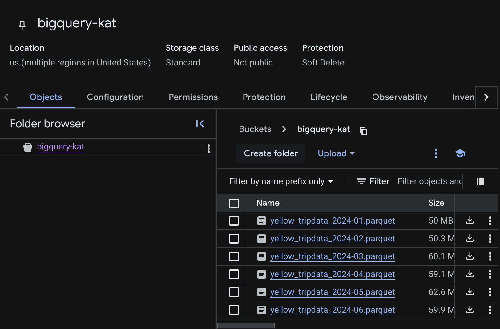

# ny-taxi-big-query

## Setup Big query with Yellow Taxi 2024 (Jan - Jun 2024).
1. Create a new project
2. Download the parquet files from [https://www.nyc.gov/site/tlc/about/tlc-trip-record-data.page] to local machine
3. Create a GCS bucket and upload the files

4. From Big Query, Set up dataset (ny_taxi_2024) and create an external table (yellow_tripdata) that points to GCS and file name match wild card yellow_tripdata_2024*.parquet
This means BigQuery does not use the data but fetch directly from GCS.

```sql
CREATE OR REPLACE EXTERNAL TABLE `bigquery-kat.ny_taxi_2024.yellow_tripdata_ext`
OPTIONS (
  format = 'PARQUET',
  uris = ['gs://bigquery-kat/yellow_tripdata_2024-*.parquet']
);
```

5. Create a regular table
Purpose: Copy data from the external table into BigQuery storage.

```sql
CREATE or REPLACE TABLE `bigquery-kat.ny_taxi_2024.yellow_tripdata`
AS
SELECT * FROM `bigquery-kat.ny_taxi_2024.yellow_tripdata_ext` 
```

## Question 1:
What is count of records for the 2024 Yellow Taxi Data?
* 65,623
* 840,402
* 20,332,093
* 85,431,289

### Answer
`20,332,093`

**Query used:**
```sql
SELECT count(*) FROM `bigquery-kat.ny_taxi_2024.yellow_tripdata`
```

## Question 2:
Write a query to count the distinct number of PULocationIDs for the entire dataset on both the tables.
What is the estimated amount of data that will be read when this query is executed on the External Table and the Table?

* 18.82 MB for the External Table and 47.60 MB for the Materialized Table
* 0 MB for the External Table and 155.12 MB for the Materialized Table
* 2.14 GB for the External Table and 0MB for the Materialized Table
* 0 MB for the External Table and 0MB for the Materialized Table

### Answer
`0 MB for the External Table and 155.12 MB for the Materialized Table`

**Query used:** 
```sql
SELECT distinct(PULocationID)
from `bigquery-kat.ny_taxi_2024.yellow_tripdata_ext`;
```


```sql
SELECT distinct(PULocationID)
from `bigquery-kat.ny_taxi_2024.yellow_tripdata`;
```


## Question 3: Write a query to retrieve the PULocationID from the table (not the external table) in BigQuery. Now write a query to retrieve the PULocationID and DOLocationID on the same table.

Why are the estimated number of Bytes different?

* BigQuery is a columnar database, and it only scans the specific columns requested in the query. Querying two columns (PULocationID, DOLocationID) requires reading more data than querying one column (PULocationID), leading to a higher estimated number of bytes processed.
* BigQuery duplicates data across multiple storage partitions, so selecting two columns instead of one requires scanning the table twice, doubling the estimated bytes processed.
* BigQuery automatically caches the first queried column, so adding a second column increases processing time but does not affect the estimated bytes scanned.
* When selecting multiple columns, BigQuery performs an implicit join operation between them, increasing the estimated bytes processed

### Answer
`BigQuery is a columnar database, and it only scans the specific columns requested in the query. Querying two columns (PULocationID, DOLocationID) requires reading more data than querying one column (PULocationID), leading to a higher estimated number of bytes processed.`

## Question 4:
How many records have a fare_amount of 0?

* 128,210
* 546,578
* 20,188,016
* 8,333

### Answer
`8,333`

**Query used:**
```sql
SELECT count(*)
from `bigquery-kat.ny_taxi_2024.yellow_tripdata`
where fare_amount =0
```

## Question 5:
What is the best strategy to make an optimized table in Big Query if your query will always filter based on tpep_dropoff_datetime and order the results by VendorID (Create a new table with this strategy)

* Partition by tpep_dropoff_datetime and Cluster on VendorID
* Cluster on by tpep_dropoff_datetime and Cluster on VendorID
* Cluster on tpep_dropoff_datetime Partition by VendorID
* Partition by tpep_dropoff_datetime and Partition by VendorID

### Answer
`Partition by tpep_dropoff_datetime and Cluster on VendorID`

**Query used:**
```sql
CREATE OR REPLACE TABLE `bigquery-kat.ny_taxi_2024.yellow_tripdata_partitioned_clustered`
PARTITION BY DATE(tpep_dropoff_datetime)
CLUSTER BY VendorID AS
SELECT * FROM `bigquery-kat.ny_taxi_2024.yellow_tripdata`;
```


## Question 6:
Write a query to retrieve the distinct VendorIDs between tpep_dropoff_datetime 2024-03-01 and 2024-03-15 (inclusive)

Use the materialized table you created earlier in your from clause and note the estimated bytes. Now change the table in the from clause to the partitioned table you created for question 5 and note the estimated bytes processed. What are these values?

Choose the answer which most closely matches.

* 12.47 MB for non-partitioned table and 326.42 MB for the partitioned table
* 310.24 MB for non-partitioned table and 26.84 MB for the partitioned table
* 5.87 MB for non-partitioned table and 0 MB for the partitioned table
* 310.31 MB for non-partitioned table and 285.64 MB for the partitioned table

### Answer
`310.24 MB for non-partitioned table and 26.84 MB for the partitioned table`

**Query used**
```sql
SELECT distinct(VendorID) as trips
FROM `bigquery-kat.ny_taxi_2024.yellow_tripdata_partitioned_clustered`
WHERE DATE(tpep_dropoff_datetime) BETWEEN '2024-03-01' AND '2024-03-15'
```

```sql
SELECT distinct(VendorID) as trips
FROM `bigquery-kat.ny_taxi_2024.yellow_tripdata`
WHERE DATE(tpep_dropoff_datetime) BETWEEN '2024-03-01' AND '2024-03-15'
```

## Question 7:
Where is the data stored in the External Table you created?

* Big Query
* Container Registry
* GCP Bucket
* Big Table

### Answer
`GCP Bucket`

**Explain:** With external tables, Big Query does not store it but will read data on demand. In this case, data is still stored in GCS. 

## Question 8:
It is best practice in Big Query to always cluster your data:

* True
* False

### Answer
`False`

**Explain:** Depending on the use case, we can choose whether to cluster data. There are scenarios where clustering might not be a good idea like: Table < 1 GB, Column has very low cardinality, Queries don’t filter or aggregate on clustered columns, Data is constantly inserted randomly (heavy reclustering cost)
