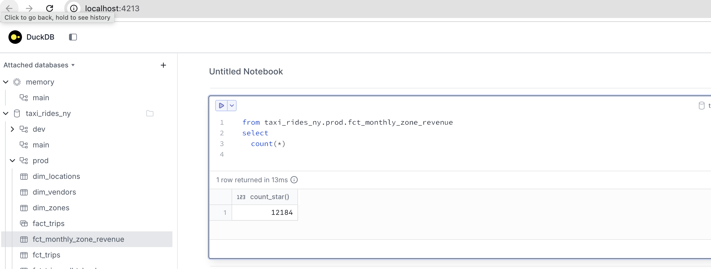
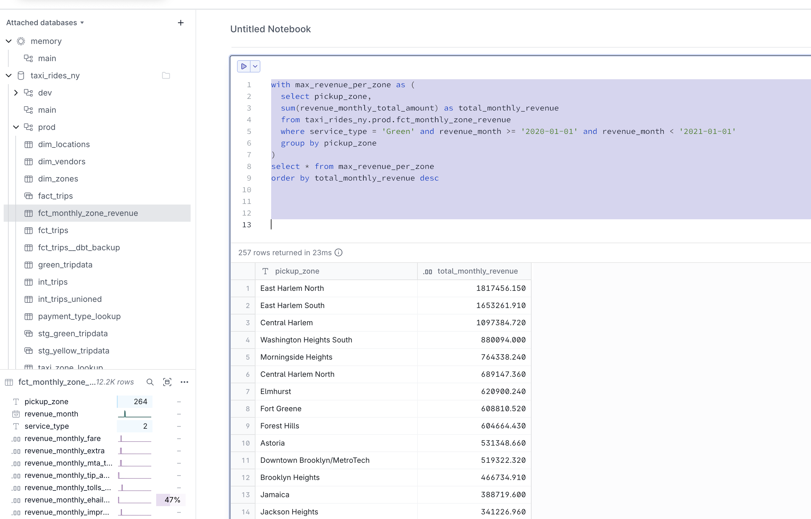
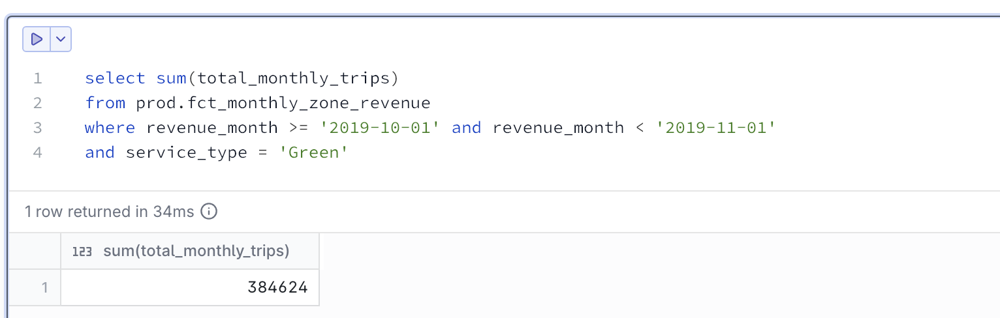
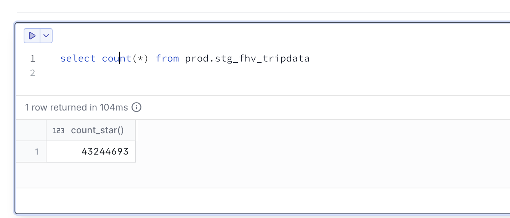

### Local Setup
1. Create and activate a Python virtual environment.
2. Install required dependencies:
    - dbt-duckdb (dbt adapter for DuckDB)
    - DuckDB CLI (via Homebrew)
3. Configure dbt by editing ~/.dbt/profiles.yml to point to the local DuckDB database.
4. Add and run the ingestion script to create and populate the DuckDB database.
5. Launch DuckDB UI (duckdb --ui), copy the path to taxi_rides_ny.duckdb, and register it as a local database.
6. Verify the setup by running dbt debug.

## Question 1
Given a dbt project with the following structure:
```
models/
├── staging/
│   ├── stg_green_tripdata.sql
│   └── stg_yellow_tripdata.sql
└── intermediate/
    └── int_trips_unioned.sql (depends on stg_green_tripdata & stg_yellow_tripdata)
```

If you run dbt run --select int_trips_unioned, what models will be built?

- stg_green_tripdata, stg_yellow_tripdata, and int_trips_unioned (upstream dependencies)
- Any model with upstream and downstream dependencies to int_trips_unioned
- int_trips_unioned only
- int_trips_unioned, int_trips, and fct_trips (downstream dependencies)

### Answer
`int_trips_unioned only`

### Explain
***--select*** by default only select the file itself. For upstream and downstream we need to include ***+***
For example: `dbt run --select +int_trips_unioned` or `dbt run --select int_trips_unioned+`


## Question 2
You've configured a generic test like this in your schema.yml:

```
columns:
  - name: payment_type
    data_tests:
      - accepted_values:
          arguments:
            values: [1, 2, 3, 4, 5]
            quote: false
```

Your model fct_trips has been running successfully for months. A new value 6 now appears in the source data.

What happens when you run dbt test --select fct_trips?

- dbt will skip the test because the model didn't change
- dbt will fail the test, returning a non-zero exit code
- dbt will pass the test with a warning about the new value
- dbt will update the configuration to include the new value

### Answer
`dbt will fail the test, returning a non-zero exit code`

### Explain
If there is any row returned from the dbt test, dbt test will fail, unless we set the severity as ***warn***.

## Question 3
After running your dbt project, query the fct_monthly_zone_revenue model.

What is the count of records in the fct_monthly_zone_revenue model?

- 12,998
- 14,120
- 12,184
- 15,421

### Answer
`12,184`

### Explain


## Question 4
Question 4. Best Performing Zone for Green Taxis (2020)
Using the fct_monthly_zone_revenue table, find the pickup zone with the highest total revenue (revenue_monthly_total_amount) for Green taxi trips in 2020.

Which zone had the highest revenue?

- East Harlem North
- Morningside Heights
- East Harlem South
- Washington Heights South

### Answer
`East Harlem North`

### Query used
To determine the best-performing pickup zones for Green taxis in 2020, I aggregated total monthly revenue by zone and sorted the results in descending order to obtain a revenue ranking. The query used is shown below:

 ```
 with max_revenue_per_zone as (
  select pickup_zone,
	sum(revenue_monthly_total_amount) as total_monthly_revenue
  from taxi_rides_ny.prod.fct_monthly_zone_revenue
  where service_type = 'Green' and revenue_month >= '2020-01-01' and revenue_month < '2021-01-01'
  group by pickup_zone
)
select * from max_revenue_per_zone
order by total_monthly_revenue desc
 ```



## Question 5
Using the fct_monthly_zone_revenue table, what is the total number of trips (total_monthly_trips) for Green taxis in October 2019?

- 500,234
- 350,891
- 384,624
- 421,509

### Answer
`384,624`

### Query used
```
select sum(total_monthly_trips)
from prod.fct_monthly_zone_revenue
where revenue_month >= '2019-10-01' 
    and revenue_month < '2019-11-01'
    and service_type = 'Green'
```




## Question 6
Create a staging model for the For-Hire Vehicle (FHV) trip data for 2019.

Load the FHV trip data for 2019 into your data warehouse
Create a staging model stg_fhv_tripdata with these requirements:
Filter out records where dispatching_base_num IS NULL
Rename fields to match your project's naming conventions (e.g., PUlocationID → pickup_location_id)
What is the count of records in stg_fhv_tripdata?

- 42,084,899
- 43,244,693
- 22,998,722
- 44,112,187

### Answer
`43,244,693`

### Explain
Steps to complete this exercise:
1. Create an ingestion script (ingest-q6.py) and execute to load data of FHV trip data for 2019.
2. Create staging model stg_fhv_tripdata and added columm definitions in sources.yml
3. Run duckdb ui to verify the new tables and run count.


