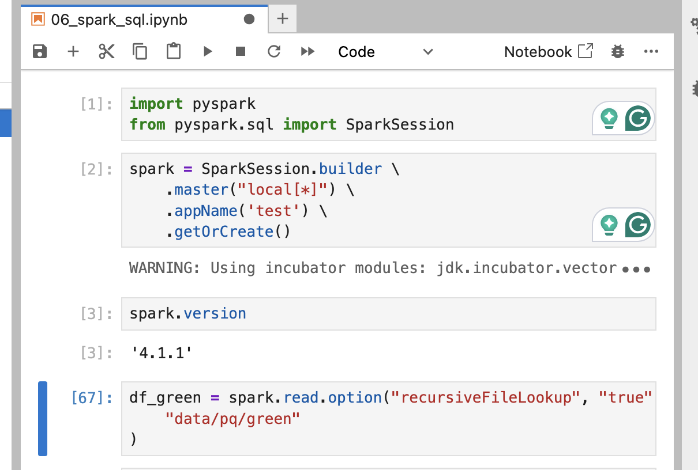
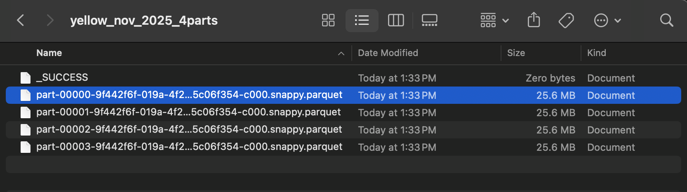
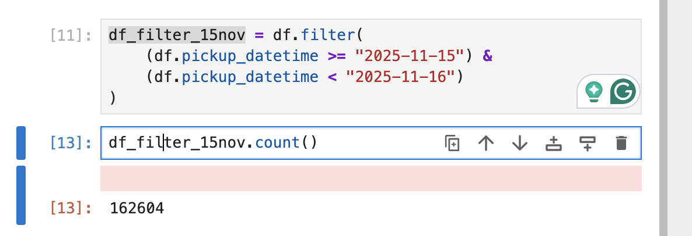
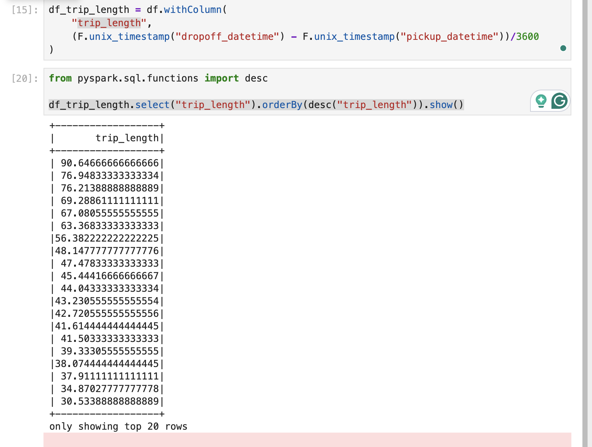
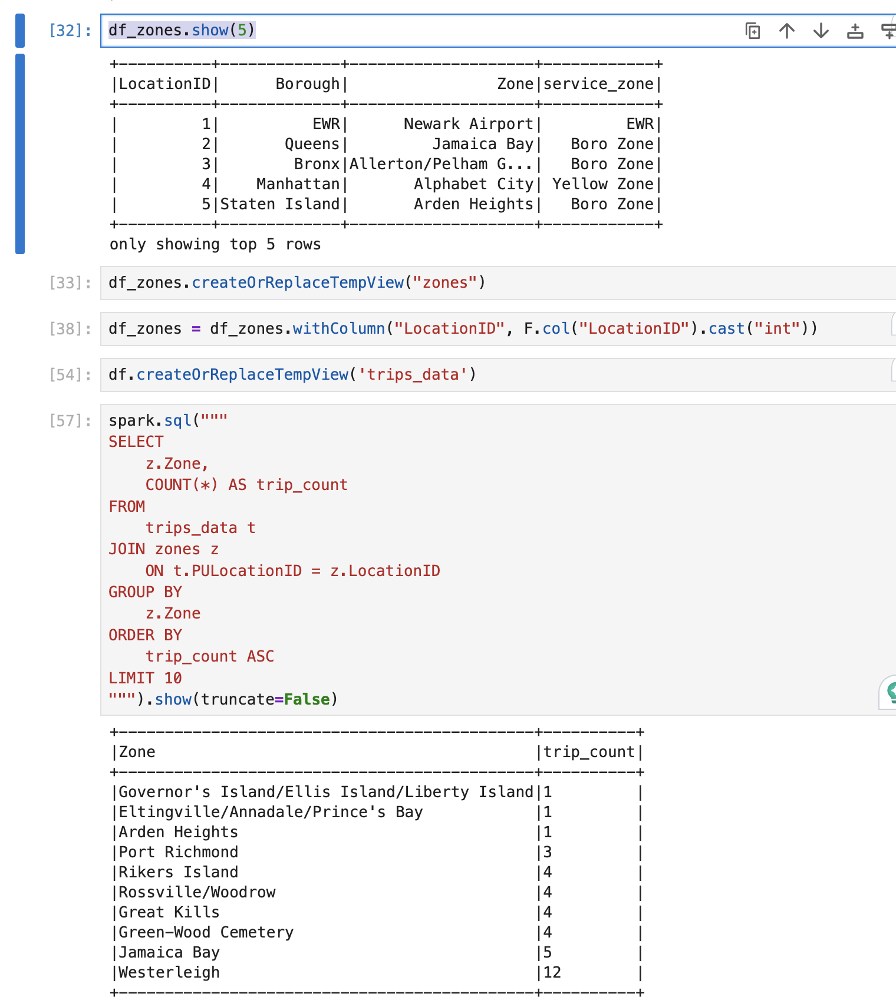

# Module 6 Homework

## Question 1: Install Spark and PySpark
- Install Spark
- Run PySpark
- Create a local spark session
- Execute spark.version.

### Answer
`4.1.1`

**Explain**

Refer to file 06_spark_sql.ipynb for commands

## Question 2: Yellow November 2025

Read the November 2025 Yellow into a Spark Dataframe.

Repartition the Dataframe to 4 partitions and save it to parquet.

What is the average size of the Parquet (ending with .parquet extension) Files that were created (in MB)? Select the answer which most closely matches.

- 6MB
- 25MB
- 75MB
- 100MB

### Answer
`25MB`

**Explain**

Refer to file 06_spark_sql.ipynb for commands

## Question 3: Count records

How many taxi trips were there on the 15th of November?

Consider only trips that started on the 15th of November.

- 62,610
- 102,340
- 162,604
- 225,768

### Answer
`162,604`

**Explain**

Refer to file 06_spark_sql.ipynb for commands

## Question 4: Longest trip
What is the length of the longest trip in the dataset in hours?

- 22.7
- 58.2
- 90.6
- 134.5

### Answer
`90.6`

Refer to file 06_spark_sql.ipynb for commands

**Explain**

## Question 5: User Interface
Spark's User Interface which shows the application's dashboard runs on which local port?

- 80
- 443
- 4040
- 8080

### Answer
`4040`

## Question 6: Least frequent pickup location zone
Load the zone lookup data into a temp view in Spark:

`wget https://d37ci6vzurychx.cloudfront.net/misc/taxi_zone_lookup.csv`
Using the zone lookup data and the Yellow November 2025 data, what is the name of the LEAST frequent pickup location Zone?

- Governor's Island/Ellis Island/Liberty Island
- Arden Heights
- Rikers Island
- Jamaica Bay
If multiple answers are correct, select any

### Answer
`Governor's Island/Ellis Island/Liberty Island`
`Arden Heights`

**Explain**

Refer to file 06_spark_sql.ipynb for commands
